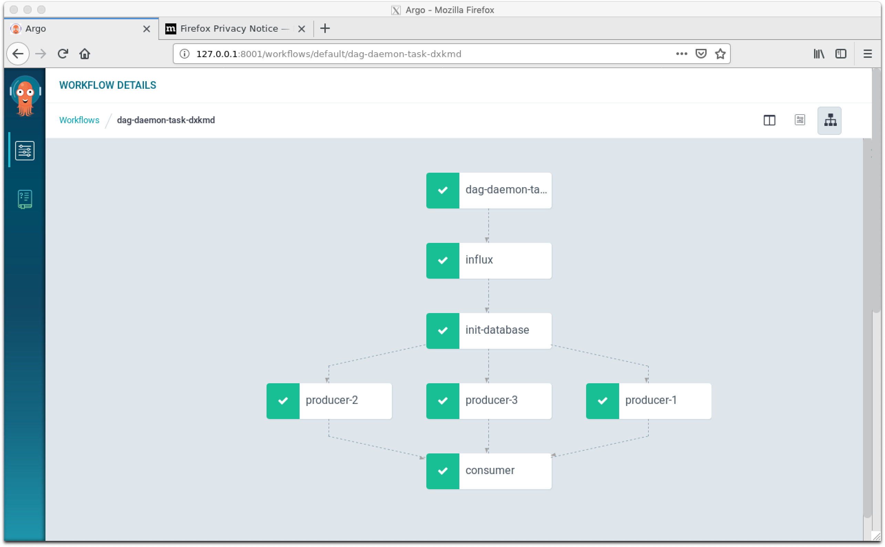
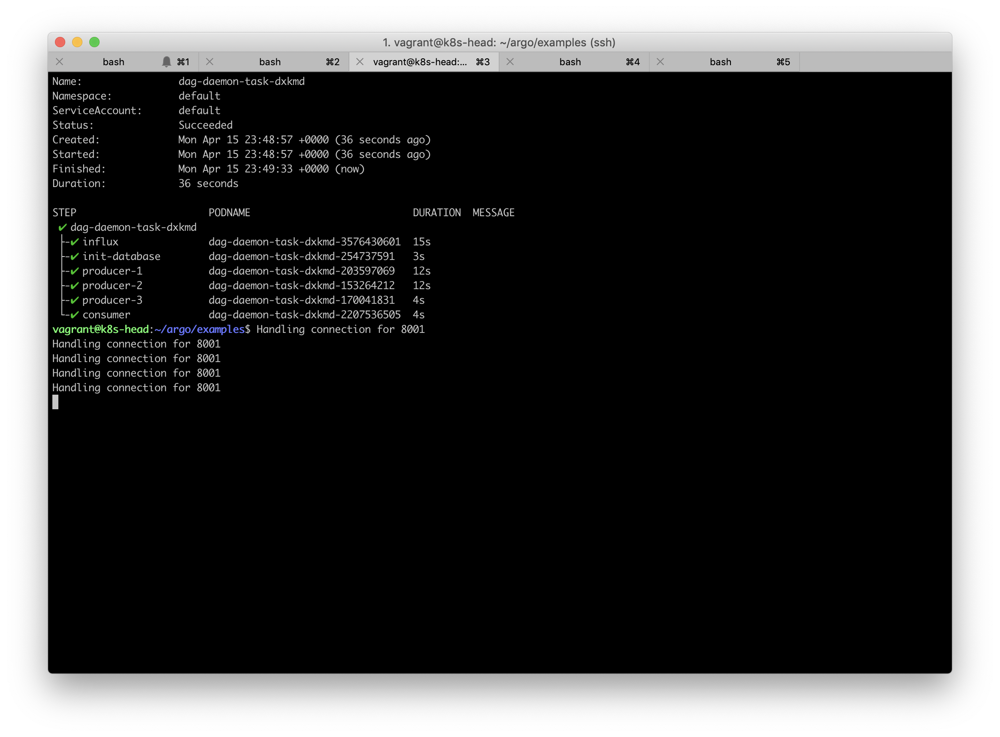
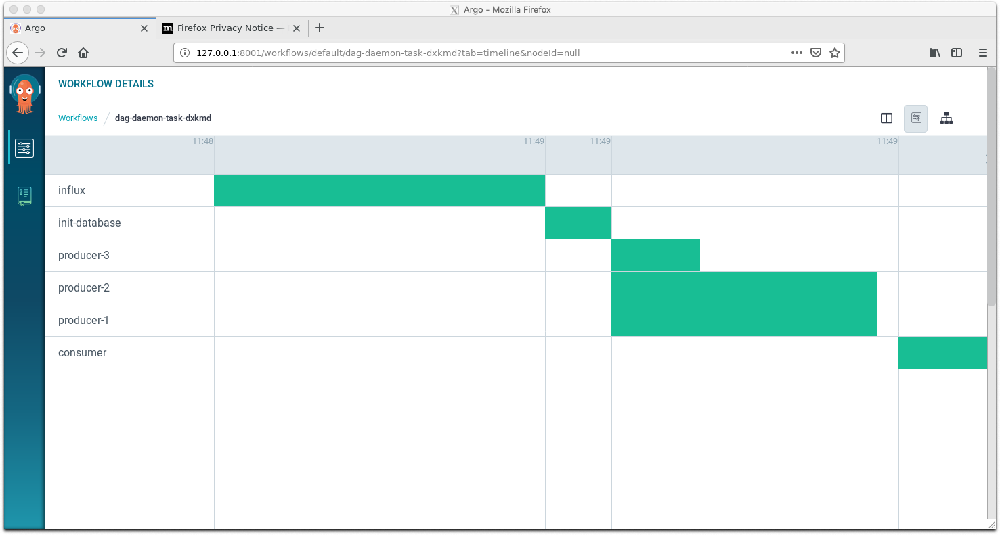
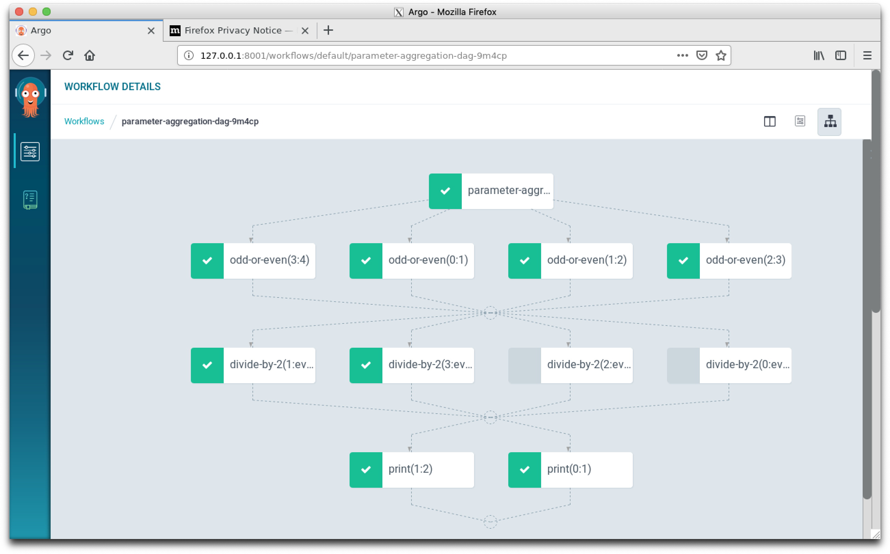
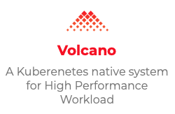
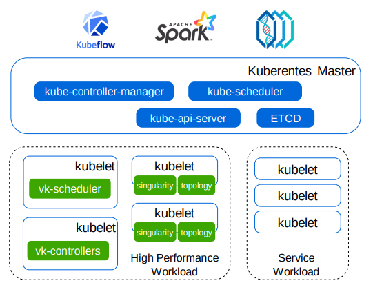

# Collaboration Space

__RULES__: No propriety information and/or content

## Subdirectories

### Vagrant k8s/slurm cluster -- kubernetes-cluster

#### Configuration

> 3 nodes
 k8s-head
 k8s-node-[1-2]

 > S/W stack : k8s(1.14), docker(17.03.3-ce), slurm(15.08.7), openmpi(1.10.2)


_NOTE_: this has been tested against vagrant version: 2.2.4 and requires _vagrant hostmanager plugin_ for host to vb networking also it sets up the vb /etc/hosts for us, and secondly _vagrant-vbguest_ so we can have a shared disk space between the hosts to copy files around.

https://kvz.io/blog/2013/01/16/vagrant-tip-keep-virtualbox-guest-additions-in-sync/


E.g.

```bash
$ vagrant plugin install vagrant-hostmanager
$ vagrant plugin install vagrant-vbguest
```

```bash
cd kubernetes-cluster
vagrant up
vagrant ssh k8s-head
```

This will start the cluster, k8s and slurm.

```bash
vagrant@k8s-head:~$ kubectl get nodes -o wide
NAME         STATUS   ROLES    AGE     VERSION   INTERNAL-IP      EXTERNAL-IP   OS-IMAGE             KERNEL-VERSION      CONTAINER-RUNTIME
k8s-head     Ready    master   5m36s   v1.14.1   192.168.205.10   <none>        Ubuntu 16.04.6 LTS   4.4.0-143-generic   docker://17.3.3
k8s-node-1   Ready    <none>   3m44s   v1.14.1   192.168.205.11   <none>        Ubuntu 16.04.6 LTS   4.4.0-143-generic   docker://17.3.3
k8s-node-2   Ready    <none>   117s    v1.14.1   192.168.205.12   <none>        Ubuntu 16.04.6 LTS   4.4.0-143-generic   docker://17.3.3
```

Inspect if the partition is responsive

```bash
vagrant@k8s-head:~$ sinfo -l 
Sun Apr 14 20:05:25 2019
PARTITION AVAIL  TIMELIMIT   JOB_SIZE ROOT    SHARE     GROUPS  NODES       STATE NODELIST
p1*          up   infinite 1-infinite   no       NO        all      2        idle k8s-node-[1-2]
```

Submit a simple one-line command

```bash
vagrant@k8s-head:~$ srun -N2 -l '/bin/hostname'
1: k8s-node-2
0: k8s-node-1
```

### Argo

__Remember__ : sudo to root for admin stuff

We should be using the latest rc release as it supports workflow templates that support specifying an alternative scheduler.

1. Download
```bash
sudo curl -sSL -o /usr/local/bin/argo https://github.com/argoproj/argo/releases/download/v2.3.0-rc1/argo-linux-amd64
sudo chmod +x /usr/local/bin/argo
```

2. Install the Controller and UI
```bash
vagrant@k8s-head:~$ kubectl create ns argo
namespace/argo created
vagrant@k8s-head:~$ kubectl apply -n argo -f https://raw.githubusercontent.com/argoproj/argo/v2.3.0-rc1/manifests/install.yaml
customresourcedefinition.apiextensions.k8s.io/workflows.argoproj.io created
serviceaccount/argo created
serviceaccount/argo-ui created
clusterrole.rbac.authorization.k8s.io/argo-aggregate-to-admin created
clusterrole.rbac.authorization.k8s.io/argo-aggregate-to-edit created
clusterrole.rbac.authorization.k8s.io/argo-aggregate-to-view created
clusterrole.rbac.authorization.k8s.io/argo-cluster-role created
clusterrole.rbac.authorization.k8s.io/argo-ui-cluster-role created
clusterrolebinding.rbac.authorization.k8s.io/argo-binding created
clusterrolebinding.rbac.authorization.k8s.io/argo-ui-binding created
configmap/workflow-controller-configmap created
service/argo-ui created
deployment.apps/argo-ui created
deployment.apps/workflow-controller created
```

3. Configure the service account to run workflows

To run all of the examples in this guide, the 'default' service account is too limited to support features such as artifacts, outputs, access to secrets, etc... For demo purposes, run the following command to grant admin privileges to the 'default' service account in the namespace 'default':

```bash
kubectl create rolebinding default-admin --clusterrole=admin --serviceaccount=default:default
```
4. Run Simple Example Workflows

```bash
argo submit --watch https://raw.githubusercontent.com/argoproj/argo/master/examples/hello-world.yaml

 ● hello-world-cxnh8  hello-world-cxnh8  38s
Name:                hello-world-cxnh8
Namespace:           default
ServiceAccount:      default
Status:              Succeeded
Created:             Tue Apr 09 22:09:29 +0000 (39 seconds ago)
Started:             Tue Apr 09 22:09:29 +0000 (39 seconds ago)
Finished:            Tue Apr 09 22:10:08 +0000 (now)
Duration:            39 seconds

STEP                  PODNAME            DURATION  MESSAGE
 ✔ hello-world-cxnh8  hello-world-cxnh8  38s
 ```

 See what ran
 ```bash
 vagrant@k8s-head:~$ argo list
NAME                STATUS      AGE   DURATION
hello-world-cxnh8   Succeeded   1m    39s
```

Get the application status
```bash
vagrant@k8s-head:~$ argo get hello-world-cxnh8
Name:                hello-world-cxnh8
Namespace:           default
ServiceAccount:      default
Status:              Succeeded
Created:             Tue Apr 09 22:09:29 +0000 (1 minute ago)
Started:             Tue Apr 09 22:09:29 +0000 (1 minute ago)
Finished:            Tue Apr 09 22:10:08 +0000 (1 minute ago)
Duration:            39 seconds

STEP                  PODNAME            DURATION  MESSAGE
 ✔ hello-world-cxnh8  hello-world-cxnh8  38s
 ```

 Get the logs/output

 ```bash
 vagrant@k8s-head:~$ argo logs  hello-world-cxnh8
 _____________
< hello world >
 -------------
    \
     \
      \
                    ##        .
              ## ## ##       ==
           ## ## ## ##      ===
       /""""""""""""""""___/ ===
  ~~~ {~~ ~~~~ ~~~ ~~~~ ~~ ~ /  ===- ~~~
       \______ o          __/
        \    \        __/
          \____\______/
```

Some more compilicated DAG workflows

Web interface, DAG graph


Console output


Look at the task timings


A more complicated DAG



Secifying an alternate scheduer to use -- nero-scheduler.

```bash
apiVersion: argoproj.io/v1alpha1
kind: Workflow
metadata:
  generateName: hello-world-
spec:
  entrypoint: whalesay
  templates:
  - name: whalesay
    schedulerName: nero-scheduler
    container:
      image: docker/whalesay:latest
      command: [cowsay]
      args: ["hello world"]
 ```
 

Argo support both DAG operations and suspend and resume but ML/DL workflows use kubeflow, which is based on Argo.

DAG
```bash
 argo submit --watch https://raw.githubusercontent.com/argoproj/argo/master/examples/dag-diamond.yaml
 vagrant@k8s-head:~$ argo list
NAME                STATUS      AGE   DURATION
dag-diamond-tt5c7   Succeeded   1m    32s
hello-world-cxnh8   Succeeded   2h    39s
vagrant@k8s-head:~$ argo get dag-diamond-tt5c7
Name:                dag-diamond-tt5c7
Namespace:           default
ServiceAccount:      default
Status:              Succeeded
Created:             Wed Apr 10 00:16:58 +0000 (1 minute ago)
Started:             Wed Apr 10 00:16:58 +0000 (1 minute ago)
Finished:            Wed Apr 10 00:17:30 +0000 (1 minute ago)
Duration:            32 seconds

STEP                  PODNAME                       DURATION  MESSAGE
 ✔ dag-diamond-tt5c7
 ├-✔ A                dag-diamond-tt5c7-1699264007  23s
 ├-✔ B                dag-diamond-tt5c7-1716041626  4s
 ├-✔ C                dag-diamond-tt5c7-1732819245  2s
 └-✔ D                dag-diamond-tt5c7-1615375912  2s
 ```

 Suspend and Resume

 ```bash
 argo submit --watch https://raw.githubusercontent.com/argoproj/argo/master/examples/suspend-template.yaml
 Name:                suspend-template-cn92n
Namespace:           default
ServiceAccount:      default
Status:              Succeeded
Created:             Wed Apr 10 00:20:27 +0000 (2 minutes ago)
Started:             Wed Apr 10 00:20:27 +0000 (2 minutes ago)
Finished:            Wed Apr 10 00:22:51 +0000 (now)
Duration:            2 minutes 24 seconds

STEP                       PODNAME                            DURATION  MESSAGE
 ✔ suspend-template-cn92n
 ├---✔ build               suspend-template-cn92n-2659848379  4s
 ├---✔ approve
 ```

 In another window, _resume the workflow_

 ```bash
 vagrant@k8s-head:~$ argo list
NAME                     STATUS                AGE   DURATION
suspend-template-cn92n   Running (Suspended)   1m    1m
dag-diamond-tt5c7        Succeeded             5m    32s
hello-world-cxnh8        Succeeded             2h    39s
vagrant@k8s-head:~$ argo resume suspend-template-cn92n
workflow suspend-template-cn92n resumed
```

The workflow resumes...
```bash
...
STEP                       PODNAME                            DURATION  MESSAGE
 ✔ suspend-template-cn92n
 ├---✔ build               suspend-template-cn92n-2659848379  4s
 ├---✔ approve
 └---✔ release             suspend-template-cn92n-2792706664  4s
 ```

Slurm is all configured to run and it's the latest version, __slurm 19.05.0-0pre3__

```bash
vagrant@k8s-head:~$ sinfo -l
Thu Apr 18 10:23:30 2019
PARTITION AVAIL  TIMELIMIT   JOB_SIZE ROOT OVERSUBS     GROUPS  NODES       STATE NODELIST
p1*          up   infinite 1-infinite   no       NO        all      2        idle k8s-node-[1-2]
```

## Demo of kube-batch and Volcano

### kube-batch

See [kubebatch](https://github.com/kubernetes-sigs/kube-batch)

### Volcano
See [volcano](https://github.com/kubernetes-sigs/kube-batch/blob/master/doc/usage/volcano_intro.md) 





The process is
* install helm
* install kube-batch
* install volcano


### Demo setup

We need a few prerequisits. 

#### Helm.

```bash
~$ sudo curl https://raw.githubusercontent.com/helm/helm/master/scripts/get | bash

~$ elmdel() {  kubectl -n kube-system delete deployment tiller-deploy;  kubectl delete clusterrolebinding tiller;  kubectl -n kube-system delete serviceaccount tiller;   }

~$ helmins() {  kubectl -n kube-system create serviceaccount tiller;  kubectl create clusterrolebinding tiller --clusterrole cluster-admin --serviceaccount=kube-system:tiller;  helm init --service-account=tiller; }

# Initialize helm
~$ helmins
~$ kubectl get pods --all-namespaces | grep tiller
kube-system   tiller-deploy-8458f6c667-kr7kg     1/1     Running   0          56s
```

#### Kube-batch

```bash
~$ sudo bash
```

pull the offical kube-batch image from dockerhub
```bash
~# docker pull kubesigs/kube-batch:v0.4
```

Check to see if go is installed and what the values are set to
```bash
~# go env
```

if not Install a newer version of go > 1.6

```bash
~# wget https://dl.google.com/go/go1.12.2.linux-amd64.tar.gz
~# tar -xvf go1.12.2.linux-amd64.tar.gz
~# mv go /usr/local
~# export GOROOT=/usr/local/go
~# export PATH=$PATH:/usr/local/go/bin
~# go env
~# go version
~# export GOPATH="/root/projects"
~# mkdir -p $GOPATH
~# go env
```

```bash
~# mkdir -p $GOPATH/src/github.com/kubernetes-sigs/
~# cd $GOPATH/src/github.com/kubernetes-sigs/
~# git clone -b v0.4.2 http://github.com/kubernetes-sigs/kube-batch

~# kubectl get deployments -n kube-system kube-batch

~# kubectl get pods --all-namespaces | grep tiller
~# kubectl create serviceaccount --namespace kube-system tiller
~# kubectl create clusterrolebinding tiller-cluster-rule --clusterrole=cluster-admin --serviceaccount=kube-system:tiller
~# kubectl patch deploy --namespace kube-system tiller-deploy -p '{"spec":{"template":{"spec":{"serviceAccount":"tiller"}}}}'

#### Modify the parameters, cuz the VM doesn't have enough resources for kube-batch
cd $GOPATH/src/github.com/kubernetes-sigs/kube-batch/deployment/kube-batch
vi values.yaml

#### Change the memory limits
# memory: 1024Mi
# cpu: 1000m

cd $GOPATH/src/github.com/kubernetes-sigs/kube-batch
cp example/role.yaml deployment/kube-batch/templates/
helm install $GOPATH/src/github.com/kubernetes-sigs/kube-batch/deployment/kube-batch --namespace kube-system
kubectl get deployments -n kube-system
helm list
```

```bash
kubectl get deployments -n kube-system
NAME            READY   UP-TO-DATE   AVAILABLE   AGE
calico-typha    0/0     0            0           92m
coredns         2/2     2            2           92m
kube-batch      1/1     1            1           14s
tiller-deploy   1/1     1            1           43m

helm list
NAME          	REVISION	UPDATED                 	STATUS  	CHART           	APP VERSION	NAMESPACE
flabby-echidna	1       	Fri Apr 26 16:39:05 2019	DEPLOYED	kube-batch-0.4.1	           	kube-system
```

Remove kube-batch if necessary
```bash
kubectl delete  deployments kube-batch -n kube-system
kubectl delete customresourcedefinitions podgroups.scheduling.incubator.k8s.io
kubectl delete customresourcedefinitions queues.scheduling.incubator.k8s.io

kubectl get deployments -n kube-system
helm list
helm delete <name from the above>
```

[Instructions for the above](https://github.com/kubernetes-sigs/kube-batch/blob/master/doc/usage/tutorial.md)

#### Volcano
```bash
docker pull volcanosh/vk-scheduler
docker pull volcanosh/vk-admission
docker pull volcanosh/vk-controllers
docker pull volcanosh/example-mpi:0.0.1


mkdir -p $GOPATH/src/volcano.sh/
cd $GOPATH/src/volcano.sh/
git clone https://github.com/volcano-sh/volcano.git
cd volcano
make cli
install -m 755 _output/bin/linux/amd64/vkctl /usr/local/bin/

helm plugin install installer/chart/volcano/plugins/gen-admission-secret
Installed plugin: gen-admission-secret

helm gen-admission-secret --service volcano-admission-service --namespace volcano
creating certs in tmpdir /tmp/tmp.dPLA10HeWm
Generating RSA private key, 2048 bit long modulus
..........................+++
.......................................................+++
e is 65537 (0x10001)
certificatesigningrequest.certificates.k8s.io/volcano-admission-service.volcano created
NAME                                AGE   REQUESTOR          CONDITION
volcano-admission-service.volcano   0s    kubernetes-admin   Pending
certificatesigningrequest.certificates.k8s.io/volcano-admission-service.volcano approved
secret/volcano-admission-secret created

kubectl delete customresourcedefinitions podgroups.scheduling.incubator.k8s.io
kubectl delete customresourcedefinitions queues.scheduling.incubator.k8s.io
helm install installer/chart/volcano/ --namespace volcano --name volcano

kubectl get deployments -n volcano
NAME                  READY   UP-TO-DATE   AVAILABLE   AGE
volcano-admission     1/1     1            1           54s
volcano-controllers   1/1     1            1           54s
volcano-scheduler     1/1     1            1           54s

kubectl get pods -n volcano
NAME                                   READY   STATUS    RESTARTS   AGE
volcano-admission-5597b84c4d-2r8zl     1/1     Running   0          3m25s
volcano-controllers-655ddc56d9-jlfgx   1/1     Running   0          3m25s
volcano-scheduler-6fc69b957d-9dsqz     1/1     Running   0          3m25s
```


[Instructions for the above](https://github.com/kubernetes-sigs/kube-batch/blob/master/doc/usage/volcano_intro.md)

### MPI & Volcano

```bash
export GOPATH="/root/projects"
cd $GOPATH/src/volcano.sh/volcano/example/integrations/mpi
kubectl create -f mpi-example.yaml
vkctl job list

vkctl job list
Name                     Creation                 Phase       Replicas    Min   Pending   Running   Succeeded   Failed
lm-mpi-job               2019-04-26 17:35:11      Completed   3           3     0         0         0           0

https://volcano.sh/docs/deployment/
